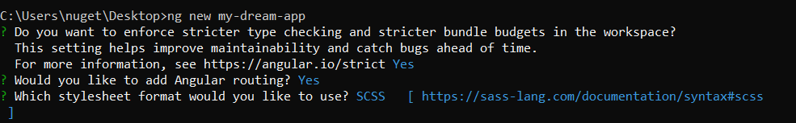

# Exercice Angular - Installation et prise en main

Le second semestre approche à grands pas, et avec lui les cours d'Angular. Ce formidable *framework*, s'il vous permettra de développer des applications web de manière robuste et puissante, nécessitera cependant de la rigueur et une dévotion sans faille de votre part.


Voici donc un tutoriel pour installer et prendre en main Angular.

## Installation

Pour installer Angular, vous avez besoin d'avoir [`NodeJS`](https://nodejs.org/en/) d'installé.
Le gestionnaire de paquets de Node, `npm`, va vous permettre d'installer [Angular CLI](https://cli.angular.io/), l'outil de lignes de commandes d'Angular. C'est avec cet outil que nous travaillerons.
Les instructions sont celles décrites sur le site :

``` bash
# Pour installer Angular CLI
npm install -g @angular/cli
# Pour générer un nouveau projet appelé "my-dream-app"
ng new my-dream-app
cd my-dream-app
# Pour lancer l'application
ng serve
```

Il est très important pour vous de faire cette étape maintenant, pour la simple et bonne raison qu'il y en a toujours deux ou trois qui ont des soucis avec Node et npm, et que si on doit régler tous les problèmes le jour J et à distance qui plus est, ça va vite nous enquiquiner.

### Terminal de commande recommandé

- sous Mac : utilisez votre terminal de commande habituel ;
- sous Linux : même chose ;
- sous Windows : **n'utilisez pas Git Bash**, utilisez un terminal de commandes classique.

Selon le terminal de commandes utilisé, la commande `ng new my-dream-app` vous pose les questions suivantes :



Si vous avez des soucis pour cette étape, envoyez un message sur Mattermost en me taguant, j'y répondrai.

## Structure du projet généré
Avec la commande `ng new my-dream-app`, vous avez généré un projet initial. Jetons un coup d'oeil à la structure de ce projet.

### Le dossier `src`
C'est le dossier qui contiendra notre application. Vous y trouverez les dossiers et fichiers suivants :

- `index.html` : il s'agit du fichier HTML qui sera accessible sur votre site ;
- `main.ts` : c'est le point d'entrée de votre application : c'est grâce aux instructions de ce fichier que votre code source sera compilé ;
- `polyfills.ts` : c'est dans ce fichier que l'on peut spécifier plusieurs scripts à charger avant la compilation de `main.ts`. Ce fichier concerne surtout la compatibilité entre navigateurs ;
- `styles.scss` : le fichier global de styles. On y importe également les feuilles de style globales telles que les variables pour les marges, couleurs, etc ;
- le dossier `environment` : ce dossier va contenir des fichiers de configuration qui permettront de différencier les environnements (développement, recette, production) sur lesquels tournera l'application ;
- le dossier `assets` contiendra toutes les ressources (images, fichiers PDF, etc) ;
- le dossier `app`, enfin, contiendra tout notre code source.

Pour en savoir plus sur les différents fichiers, rendez-vous [**sur la documentation officielle**](https://angular.io/guide/file-structure).

## Prise en main
Beaucoup de wow, much excitement, on est parti.e.s pour mettre les mains dans le cambouis.


Lancez votre application avec la commande `ng serve`, et rendez-vous sur [http://localhost:4200/](http://localhost:4200/).

### Composant et template HTML
En Angular, nous travaillons avec des modules et des composants. Un composant n'est autre qu'une classe JavaScript, portant une annotation `@Component`. 

Si vous allez voir dans le fichier `app.component.ts`, vous trouverez le code suivant :

```typescript
import { Component } from  '@angular/core';
@Component({
	selector: 'app-root',
	templateUrl: './app.component.html',
	styleUrls: ['./app.component.scss']
})
export class AppComponent {
	title = 'my-dream-app';
}
```

#### L'annotation `@Component`
L'annotation `@Component` prend en paramètre un objet : 
```js
{
	selector: 'app-root',
	templateUrl: './app.component.html',
	styleUrls: ['./app.component.scss']
}
```
Le premier champ, `selector`, spécifie la manière dont on appellera le composant au niveau HTML. Vous pouvez trouver comment est appelé `AppComponent` dans le fichier `index.html` :
```html
<app-root></app-root>
```

Le deuxième champ, `templateUrl`, spécifie l'emplacement du *template* HTML lié au composant. Il s'agit de la portion de HTML qui représentera, sur la page, votre composant. Ici, le *template* HTML lié au composant est donc `app.component.html`.

Le troisième champ, `styleUrls`, spécifie la liste des feuilles de style CSS (en l'occurrence, nous utiliserons du SCSS) qui seront utilisées par ce composant.

#### Le mot-clef `export`
Le mot-clef `export` permet tout simplement de rendre publique le composant. Sans ce mot-clef, il sera impossible à Angular de l'utiliser.

#### Les variables de composants
Reprenons le code de la classe : 

```ts
export class AppComponent {
	title = 'my-dream-app';
}
```
La classe `AppComponent` possède un attribut nommé `title`. Cet attribut, par défaut, est dit `public`. Cela signifie qu'il sera utilisable dans le *template* HTML.
On appelle le fait qu'un attribut ou une méthode (fonction à l'intérieur d'une classe) soit publique ou non, la **visibilité**.

En JavaScript comme en TypeScript, il existe trois types de visibilité :
- `public` ;
- `private` ;
- `protected`.

Nous utiliserons principalement les deux premières, et verrons la troisième plus tard.

**Faites un essai et, au lieu de `title = 'my-dream-app';`, écrivez `private title = 'my-dream-app';`. 
Voyez ce qu'il se passe dans votre terminal**.

#### Le template HTML
Allez voir dans le fichier `app.component.html` : Angular CLI y a généré **beaucoup** de HTML et de CSS.

Trouvez la ligne suivante (CTRL+F):

```html
<span>{{ title }} app is running!</span>
```
La portion de code `{{ title }}` indique à Angular qu'il faudra, à la place de `title`, injecter ce qui se trouve dans l'attribut `title` du composant.


Pour modifier le titre, il suffira donc d'aller dans le composant (fichier `app.component.ts`), et de modifier le contenu du champ `title`.  Essayez avec ceci :

```ts
title = 'Bienvenue !';
```
Et, bien sûr, dans le HTML, supprimez le "app is running!".
Normalement, le résultat devrait être le suivant :


## Pour aller plus loin
Vous pouvez commencer à voir [les autres commandes d'Angular CLI](https://angular.io/cli) ou encore vous lancer à corps perdu dans [le tutoriel d'Angular](https://angular.io/tutorial) (très complet) qui vous donnera de l'avance.

Vous pouvez également vous commander une pizza avec supplément cheesy crust. Vous l'avez mérité.


[.](https://www.youtube.com/watch?v=dQw4w9WgXcQ)
